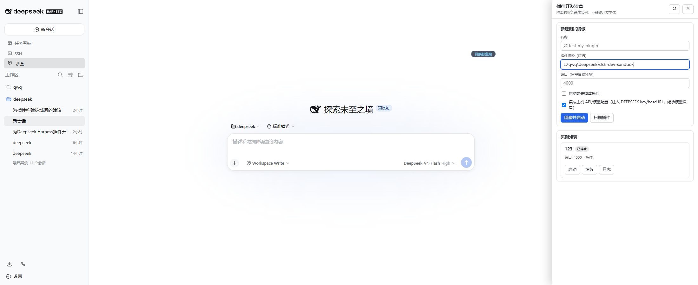
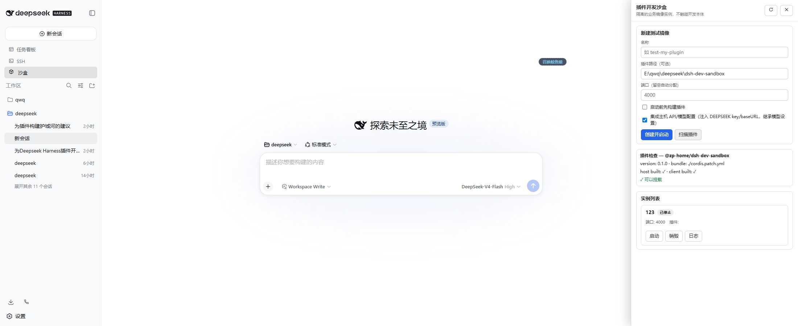

# @zp-home/dsh-dev-sandbox · DSH 插件开发沙盒

[](https://github.com/zp-home/dsh-recommend)
[](https://github.com/zp-home/dsh-recommend)
[](LICENSE)
[](https://github.com/topics/dsh-plugin)
[](https://github.com/zp-home/dsh-dev-sandbox)

> **English**: A developer sandbox for [DeepSeek Harness (dsh)](https://github.com/deepseek-ai/deepseek-harness)
> plugins. One click spawns a fully **isolated** dsh web instance — its own `DSH_HOME`, its own port, its
> own profile — that auto-mounts the plugin you are developing, so plugin work (restarts, crashes, bad
> mounts) never touches — or breaks — the development instance. Mirrors can optionally inherit the host's
> `DEEPSEEK_API_KEY`/`DEEPSEEK_BASE_URL` and model settings, so you can chat with the mirror directly.
> Ship with a GUI panel (sidebar "沙盒") and agent tools (`sandbox_*`).

---

## 痛点与方案

**痛点**：直接在开发本体上测试插件很危险——反复重启、挂载坏掉的插件、改坏配置，都可能把开发实例搞坏，而修它又得靠别的 AI 来折腾。

**方案**：一键启动一个**独立的 DSH web 业务镜像**（自己的 `DSH_HOME`、自己的端口、自己的 profile），
自动把正在开发的插件挂载进去做兼容性测试。测试、重启、搞坏，都在沙盒里发生，开发本体毫发无伤。

## 能力

- **完全隔离**：每个沙盒 = 独立 `DSH_HOME`（默认 `~/.dsh-sandboxes/<name>`，含独立的
  sessions / storages / settings / profiles）+ 独立端口（默认从 4000 起自动分配）+ 标准 web profile
  （`dsh-base` + `dsh-web-app` + 待测插件）。销毁 = 删除整个隔离目录，零残留。
- **插件路径选填**：不填插件路径 = 纯净镜像（仅标准 web 环境），适合验证插件对原生 harness 的
  兼容性，或纯粹复现/排查问题。
- **挂载待测插件**：junction 把插件源码目录挂进沙盒 profile 的 `node_modules`，插件本体无需 pnpm
  安装；沙盒从**同一个 harness 检出**启动（`node --import tsx/esm apps/cli/src/bin.ts web --port N`），
  待测插件跑在与开发时完全相同的 harness 版本上。
- **集成主机接口（默认开启）**：
  - 注入宿主的 `DEEPSEEK_API_KEY` / `DEEPSEEK_BASE_URL`（先取宿主进程环境，再回退读宿主 home 的
    `.env` 与 `.credentials.yaml`），沙盒内直接就能与 DeepSeek 对话；
  - 首次启动把宿主 `settings.yaml` 复制进沙盒 home（模型/主题默认值与宿主一致）。
  - 面板勾选框「集成主机 API/模型配置」或按沙盒/全局配置可关闭。
- **双面操作**：
  - **GUI**：侧边栏「沙盒」入口 + 面板（创建/启动/停止/重启/销毁/日志/打开测试界面/插件扫描与构建）。
  - **Agent 工具**：`sandbox_list` / `sandbox_status` / `sandbox_start` / `sandbox_stop` /
    `sandbox_destroy` / `sandbox_logs` / `sandbox_build` —— 让开发本体里的 AI 直接驱动沙盒。
- **生命周期可靠**：状态持久化（`sandbox-state.json`），宿主重启后自动校正运行状态；进程退出自动
  标记；SIGTERM 优雅停止，超时强杀；沙盒可反复重启，状态保持。

## 安装

插件行通过 profile 的 `cordis.patch.yml` 挂载；**新增**插件行需要重启一次该实例（配置 HMR 只热更
已有行的配置）。装好之后，所有插件测试都在沙盒里进行，开发本体再也不用为测试重启。

### 方式 A：GitHub 安装（推荐）

```sh
# 在 harness 检出根目录（或任意目录）执行：
dsh plugin --profile web add github:zp-home/dsh-dev-sandbox
```

### 方式 B：本地源码热挂载（无需 pnpm）

```powershell
# 1. 构建（在插件目录，使用 harness 的 tsdown）
& E:\qwq\deepseek-harness\node_modules\.bin\tsdown.cmd -c E:\qwq\deepseek\dsh-dev-sandbox\tsdown.config.ts

# 2. junction 到开发 profile 的 node_modules
New-Item -ItemType Junction `
  -Path "$env:USERPROFILE\.dsh\profiles\web\node_modules\@zp-home\dsh-dev-sandbox" `
  -Target "E:\qwq\deepseek\dsh-dev-sandbox"

# 3. 在 profile 的 cordis.patch.yml 追加：
#    - insert:
#        - id: dev-sandbox
#          name: '@zp-home/dsh-dev-sandbox'
```

然后重启一次开发实例，刷新浏览器即可看到侧边栏「沙盒」。

## 使用

1. 刷新浏览器，侧边栏出现「沙盒」。
2. 填「插件路径」= 待测插件目录（含 package.json），点「扫描插件」看构建状态；
   未构建可点「构建」或勾选「启动前构建」。**留空插件路径** = 纯净镜像。
3. 勾选「集成主机 API/模型配置」（默认勾选）→ 沙盒可直接对话。
4. 「创建并启动」→ 面板出现实例卡片：状态 / 端口 / 打开链接 / 日志。
5. 让 AI 干活：对开发本体里的 agent 说「用沙盒测试 <插件> 的兼容性」，agent 会用
   `sandbox_start` 等工具驱动沙盒，例如：

   ```
   sandbox_start name=test-a pluginPath=E:\path\to\my-plugin build=true
   sandbox_logs name=test-a
   sandbox_stop name=test-a
   sandbox_destroy name=test-a
   ```

## 使用教程

下面以“在沙盒中验证一个正在开发的插件”为例。沙盒是独立的 DSH web 进程，拥有自己的
`DSH_HOME`、profile 和端口；插件源码仍然来自你填写的本地目录，因此修改源码后重新构建并重启
沙盒即可验证最新版本。



### 1. 打开沙盒面板

安装插件并重启开发实例后，在 DeepSeek Harness 左侧导航栏点击 **沙盒**。右侧面板包含两部分：

- **新建测试镜像**：填写实例名称、插件路径、端口和配置选项。
- **实例列表**：查看状态、端口、插件路径，并执行启动、停止、重启、销毁和查看日志。

实例名称只能使用 1--32 个字母、数字、下划线或短横线，例如 `test-my-plugin`。插件路径建议填写
包含 `package.json` 的插件包目录，使用绝对路径最不容易因工作目录变化而出错。

### 2. 扫描并准备插件

1. 将插件路径填入 **插件路径（可选）**。
2. 点击 **扫描插件**，确认扫描结果中的包名、`dsh.bundle.patch`、宿主端构建产物和客户端构建产物均正常。
3. 如果扫描提示构建产物缺失，先在插件目录执行构建：

   ```sh
   pnpm run build
   ```

   也可以勾选面板中的 **启动前先构建插件** 选项，让创建流程自动执行插件的 `build` 脚本。



留空插件路径会创建一个**纯净镜像**，只包含标准 web 环境。这个模式适合先确认 Harness 本身能否正常
启动，或排查问题是否由待测插件引入。

### 3. 创建并启动实例

1. 填写实例名称；端口留空时，工具会从配置的 `basePort`（默认 `4000`）开始自动寻找空闲端口。
2. 保持 **集成主机 API/模型配置** 勾选时，沙盒会注入宿主的
   `DEEPSEEK_API_KEY` / `DEEPSEEK_BASE_URL`，并在新沙盒首次启动时继承宿主的 `settings.yaml`。
   这样可以直接在测试镜像中与 DeepSeek 对话。使用共享电脑或不希望沙盒读取凭据时，请取消勾选。
3. 点击 **创建并启动**。面板会等待 web 端口就绪，然后在实例卡片中显示状态、端口和测试地址。
4. 点击实例卡片中的地址，在新标签页打开沙盒。此页面使用独立的会话、存储和 profile；在这里重启或
   搞坏插件不会影响开发本体。

### 4. 进行一次插件测试迭代

推荐按下面的循环工作：

1. 在插件源码中修改代码。
2. 在插件目录运行 `pnpm run build`，或在面板中重新创建/启动时勾选自动构建。
3. 回到实例列表点击 **重启**，让沙盒重新加载最新的宿主端和客户端产物。
4. 打开测试地址，验证插件的面板、路由、Agent 工具和配置行为。
5. 出现异常时点击 **日志**，先查看最近的启动输出；修复后再次构建并重启。

新增插件行通常需要重启对应的 Harness 实例才能让 profile 配置生效；插件自身已有行的配置才适合依赖 HMR。

### 5. 停止、重启和销毁

- **停止**：结束沙盒进程，但保留隔离目录和状态，之后可以继续启动。
- **重启**：停止后重新启动同一个实例，保留原有名称、插件路径和 `DSH_HOME`。
- **日志**：查看沙盒捕获的最近日志；启动失败、端口占用和插件加载错误通常都能在这里找到。
- **销毁**：停止进程并永久删除该实例的整个隔离目录，包括会话、存储、profile 和日志。确认不再需要
  该实例后再执行。

### 6. 让开发本体里的 Agent 驱动沙盒

如果不想手动点击面板，可以直接在开发本体的对话中让 Agent 使用 `sandbox_*` 工具。例如：

```text
请用沙盒测试 E:\\path\\to\\my-plugin 的兼容性：创建 test-my-plugin，构建后启动，检查日志，
如果测试完成就停止实例；确认不再需要时再销毁。
```

Agent 可使用以下工具：

| 工具 | 用途 |
|---|---|
| `sandbox_list` | 列出所有沙盒及状态、端口、地址和插件路径 |
| `sandbox_status` | 查看指定沙盒状态及最近日志 |
| `sandbox_start` | 创建（不存在时）并启动沙盒，可传插件路径、端口和 `build` |
| `sandbox_stop` | 停止沙盒并保留隔离目录 |
| `sandbox_logs` | 查看指定行数的日志尾部，默认 200 行，最多 5000 行 |
| `sandbox_build` | 在插件目录执行 `pnpm run build` |
| `sandbox_destroy` | 停止并删除整个沙盒目录 |

一个典型的 Agent 调用顺序如下：

```text
sandbox_start name=test-my-plugin pluginPath=E:\\path\\to\\my-plugin build=true
sandbox_status name=test-my-plugin
sandbox_logs name=test-my-plugin tail=300
sandbox_stop name=test-my-plugin
```

### 常见问题

- **扫描提示没有 `dsh.bundle.patch`**：当前目录不是可挂载的 DSH 插件包，检查 `package.json` 中的
  `dsh.bundle.patch` 配置。
- **提示 `lib/index.js` 或 `lib/client.js` 缺失**：先在插件目录安装依赖并执行 `pnpm run build`。
- **启动超时或实例变成 `error`**：打开日志检查 Harness 路径、端口占用和插件启动异常；也可以先留空插件路径
  创建纯净镜像，判断问题来自 Harness 还是插件。
- **修改后页面没有变化**：重新构建插件并点击 **重启**；新增 profile 插件行还需要重启开发实例。
- **沙盒无法对话**：确认宿主已配置 API 凭据，并检查创建实例时是否勾选了集成主机 API/模型配置。

## 配置（插件行 config，均可选）

| 字段 | 默认 | 说明 |
|---|---|---|
| `homeRoot` | `~/.dsh-sandboxes` | 沙盒根目录（每个沙盒一个子目录 = 其 DSH_HOME） |
| `harnessRoot` | 自动探测 | dsh 源码检出根目录（含 `apps/cli/src/bin.ts`）；探测顺序：cwd → 插件位置 → `@deepseek-ai/dsh-app-boot` 解析路径 |
| `basePort` | `4000` | 沙盒端口分配起点 |
| `buildOnStart` | `false` | 每次启动前先跑插件的 build 脚本 |
| `inheritHostApi` | `true` | 注入宿主的 DEEPSEEK_API_KEY/DEEPSEEK_BASE_URL 到沙盒 |
| `inheritHostModel` | `true` | 首次启动把宿主 settings.yaml 复制进沙盒 home |
| `announceToAgent` | `true` | 是否在系统提示中宣告本插件 |
| `enabled` | `true` | 总开关 |
| `readyTimeoutMs` | `90000` | 启动等待端口就绪超时 |
| `stopTimeoutMs` | `10000` | 停止时优雅退出等待，超时强杀 |

例：

```yaml
- insert:
    - id: dev-sandbox
      name: '@zp-home/dsh-dev-sandbox'
      config:
        basePort: 5000
        buildOnStart: true
        homeRoot: '~/my-sandboxes'
```

## 架构速览

```
src/
  index.ts       宿主插件入口（name/inject/Config/apply + 系统提示公告）
  harness.ts     定位 dsh 源码检出（cwd → 插件位置 → dsh-app-boot 解析）
  manager.ts     沙盒生命周期：隔离 home/profile/junction、进程、日志环形缓冲、状态持久化、
                 主机 API 环境注入、settings 继承
  routes.ts      /api/dsh-dev-sandbox/* HTTP 路由
  tools.ts       sandbox_* agent 工具（defineTool）
  client/        浏览器端：侧边栏入口 + 面板（纯 DOM，无 React 依赖）
```

沙盒启动命令等价于：`DSH_HOME=<sandboxHome> node --import tsx/esm <harness>/apps/cli/src/bin.ts web --port N`。

## 开发

```sh
# 构建（宿主端 lib/index.js + 浏览器端 lib/client.js）
pnpm run build        # 或使用 harness 的 tsdown：& <harness>/node_modules/.bin/tsdown.cmd -c tsdown.config.ts

# 类型检查（需先安装 devDependencies）
pnpm typecheck
```

## 说明与限制

- 沙盒是真实进程：占用端口与 CPU；`destroy` 会删除整个隔离目录，请先确认。
- 沙盒 web profile 是**标准** web（base + web-app），不含开发本体的自定义插件，适合验证插件对
  原生 harness 的兼容性；沙盒进程从当前 harness 检出启动，因此会继承该检出的源码状态。
- 待测插件若有运行时依赖，需能在其目录解析（其自身 node_modules / 其所在 workspace）。
- 本插件仅监听回环地址（web server 默认 127.0.0.1），路由无鉴权，请勿暴露到公网。
- 集成主机 API 会把宿主凭据注入沙盒进程环境；关闭 `inheritHostApi` 可让沙盒完全不带 key（但仍继承
  宿主进程环境变量，无法做到完美清洗）。

## 更新日志

### v0.1.0（2026-08-16）

- 首个版本：隔离镜像沙盒、插件路径选填（纯净镜像）、集成主机 API/模型、GUI 面板 + `sandbox_*`
  agent 工具、状态持久化与进程管理。

## 贡献

欢迎 PR / Issue。请先阅读 [awesome-dsh-plugin 的 contributing.md](https://github.com/awesome-dsh-plugin/awesome-dsh-plugin/blob/main/contributing.md)（本插件已提交收录于该精选列表数据源）。

## 免责声明

插件为第三方代码，安装即在本机以你的权限运行；本列表不构成安全背书。安装前请自行审查源码，并在
不存放密钥的环境中试用不熟悉的插件。
